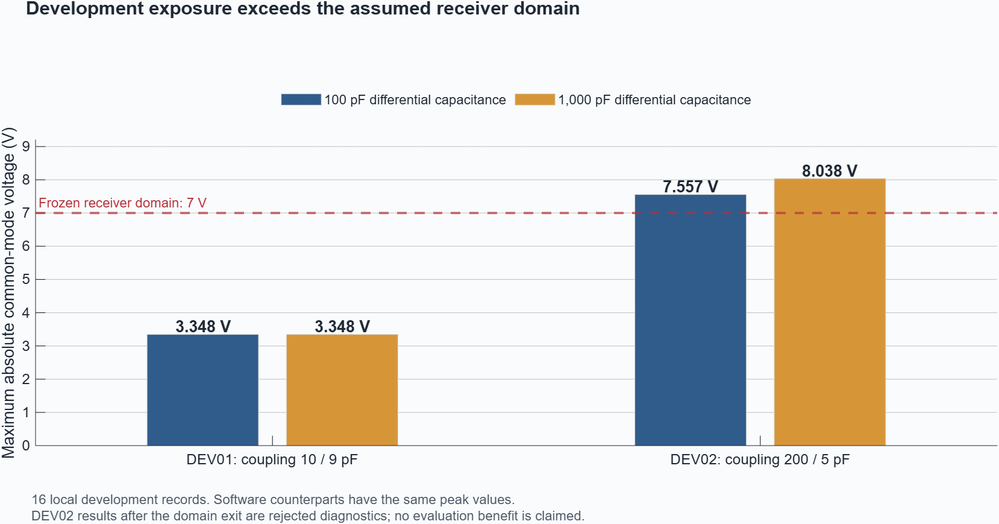

# Causal receiver checkpoint — 11 September 2026

**The causal circuit/receiver/decoder connection is implemented and numerically verified. The frozen experiment stops at development because its higher exposure exceeds the assumed receiver domain.** Evaluation acceptance is false; no combined-mitigation benefit is claimed.

The saved implementation preserves the original control policy and the unchanged FOUR-WAY-EMI-PLAN-V1 design. All work ran locally. Hardware validation remains open.

## Verification

| Check | Result |
|---|---|
| Full project regression suite | **468/468 passed**, zero failed or incomplete; 67 new tests |
| Legacy controller identity | **116/116 exact** for all 31 channels, plant states and reasons |
| Required native circuit comparisons | **24/24 numerical passes**, across eight fixtures and three maximum steps |
| Successive native refinements | **16/16 passed** |
| Largest native node-voltage error | **0.0802 mV**, below the frozen 0.1 mV allowance |
| Largest threshold-event timing difference | **0.0020 ns**, below 1 ns; discrete sequences and virtual counts exact |
| Development campaign | **16 complete records / 8 matched pairs** |
| Independent exported-record audit | **352/352 checks passed**, reconstructing 16 records and scoring 8 pairs |
| Preserved frozen inputs and historical models | **16 input hashes and 8 model hashes unchanged** |

The final native set includes six tighter-tolerance reruns after initial pointwise failures; all original records are retained. Thirty native executions produced the final 24 comparisons. Numerical agreement and receiver usability are separate: **12 of the 24 native records exceed the assumed 7 V receiver domain** and remain rejected for control-effect interpretation.

Evidence: [regression tests](Verification/Causal_Receiver_2026-09-11/all_project_tests.csv), [exact legacy identity](Verification/Causal_Receiver_2026-09-11/legacy_equivalence.json), [native comparisons](Verification/Causal_Receiver_2026-09-11/native_final_acceptance.csv), [refinements](Verification/Causal_Receiver_2026-09-11/native_final_refinements.csv), [independent audit](Verification/Causal_Receiver_2026-09-11/independent_audit.json).

## Development outcome

All eight clean companions pass tracking, command, timestamp, count-conservation and receiver-delay guards. The maximum clean receiver transition delay stays below 1 microsecond. The two exposure fixtures produce different research outcomes:

| Fixture | Coupling Ccp / Ccn | 100 pF differential capacitance | 1,000 pF differential capacitance | Outcome |
|---|---|---:|---:|---|
| DEV01 | 10 / 9 pF | 3.348 V peak common mode | 3.348 V | All four arms pass; no persistent EMI count error or paired actuator disturbance |
| DEV02 | 200 / 5 pF | 7.557 V peak common mode | 8.038 V | All four exposed arms rejected by the 7 V model-domain limit |

The software counterparts have the same peak common-mode values. DEV02 first leaves the receiver domain at approximately **0.250002044 s**; the first flagged controller packet is at **0.251 s**. Following the frozen contract, A is held only to complete diagnostic recording. The resulting later count errors, controller stops or tracking differences do **not** establish physical receiver behavior or mitigation benefit.

Individual outcomes remain in [development metrics](Verification/Causal_Receiver_2026-09-11/metrics.csv), [domain and clean-decoder checks](Verification/Causal_Receiver_2026-09-11/domain_and_clean_decoder_summary.csv), [per-burst recovery](Verification/Causal_Receiver_2026-09-11/recovery.csv), and [corruption attribution](Verification/Causal_Receiver_2026-09-11/burst_attribution.csv). DEV02 performance fields are rejected fallback diagnostics.

## What changed

The controller now accepts a strict decoded-measurement packet without plant truth or exposure annotations. Between samples, the current held voltage drives the exact motor trajectory and all intended encoder transitions, including reversals inside the interval. The loaded SC01A circuit receives every original replay knot and the declared continuous return, preserving its state. Schmitt events drive a persistent quadrature decoder before coincident packet samples.

An offline clean shadow uses each exposed run's own intended A/B trajectory. It distinguishes EMI count corruption from ordinary receiver delay without influencing control. Scoring retains the original request, shaped command, matched clean task, both recovery periods, false-alarm onsets and pre-existing corruption. The evaluation entrypoint requires complete passing evidence and exact implementation hashes; omitted records, altered files and rejected domains cannot produce approval.

Independent unit fixtures verify network KCL, shared return, matrix-exponential propagation, count directions/reversals, invalid/glitch transitions, clean timing, packet coincidences, continuous motor extrema and scoring. Unresolved grazing or a 1 ps event group spanning an already sampled packet is explicitly rejected rather than repaired with future information.

## Saved state and next step

The checkpoint is saved locally under Git tag **causal-receiver-checkpoint-2026-09-11**. The original consolidated baseline remains available. Representative actuator defaults, controller/observer thresholds, the frozen source and all historical models are unchanged.

**Production records completed: 16 development, 0 evaluation, 0 closure diagnostics.** The planned 96 evaluation and 16 closure records remain unopened. The strict [native usability report](Verification/Causal_Receiver_2026-09-11/native_usable_acceptance.json) and development report reject acceptance. The [source/acceptance manifest](Verification/Causal_Receiver_2026-09-11/rejected_acceptance.json) records that rejection; it is not an accepting evaluation freeze.

The next step is a reviewed receiver/topology decision with a defensible operating domain, followed by a new versioned experiment plan and separate development/evaluation fixtures. Preserve PLAN-V1 and these results. Do not raise its 7 V assumption or change its exposure/filter values after seeing these failures. Loaded brake handoff, hardware identification and physical validation remain separate open work.

Full development event/circuit/control records remain in the original project's MATLAB results. All original native traces, tightened reruns and final audits were copied into its FOUR_WAY results folder with a verified relocation manifest. The compact evidence here supports the report; it is not a full historical data backup.
