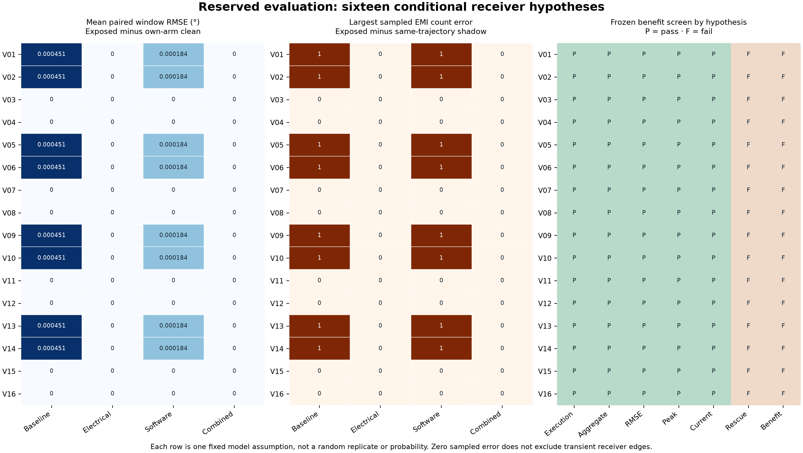
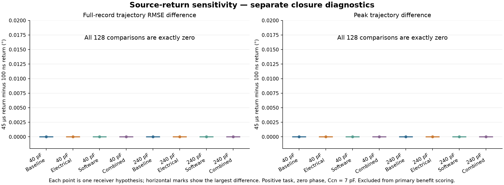

# EMI in robotics — completed PLAN-V2 results

**Conditional numerical results only.** The physical receiver's fast-pulse response, nonlinear loading/clamps and cable behavior remain unvalidated.

## Research outcome

**The frozen experiment did not demonstrate a combined electrical-and-software mitigation benefit in any of the 16 receiver hypotheses.**

The largest sampled EMI count error was 1 count; the largest paired scoring-window position RMSE was 0.0015091°. Results below retain every declared cell and model hypothesis.

**The results support a small conditional electrical-filtering effect.** Sampled EMI count errors occurred in 32/192 baseline and 32/192 software-only comparisons; none occurred in electrical-only or combined comparisons. These are counts across fixed cells and model hypotheses, not estimated probabilities. The largest paired scoring-window position peak across all arms was 0.0028388°.

Every baseline task already met the frozen task-success criteria, so there was no failed baseline task for the combined arm to rescue. The required rescued-failure gate therefore prevents a combined task-benefit claim.

Within this matrix, nonzero sampled count errors were confined to Ccp=120, 240 pF, task signs -1, 1, source phase -75 ns and assumed post-threshold latency 25 ns. This is a dependence on the declared model and timing conditions, not a measured part characteristic. The affected fixture/variant/arm rows are retained in `evaluation_affected_cases.csv`.

Largest final sampled count error: **0 counts**. A zero final error can coexist with transient errors earlier in a record.

## Evidence and coverage

| Evidence | Completed result |
| --- | --- |
| Implementation freeze | 2026-09-15T22:54:25.711932+00:00 |
| Development | 256 logical executions; 128 clean/exposed pairs; all execution and clean guards passed |
| Independent electrical agreement | 24 native waveforms × 16 hypotheses = 384 comparisons; 256 refinement checks |
| Implementation/regression checks | 155 MATLAB tests and 14 Python audit/gate tests passed |
| Independent development reconstruction | 256 records and 128 metric pairs audited |
| Reserved evaluation | 1,536 executions; 768 pairs; all 12 cells × 16 hypotheses × four arms |
| Closure diagnostics | 256 exposed executions; 128 return comparisons, excluded from primary scoring |

Native pin-voltage disagreement was at most **2.5039 µV**, and differential-voltage disagreement **4.9358 µV**, each against a 100 µV allowance. Event-time disagreement was at most **2.82e-05 ns**, against a 1 ns allowance. Integer sampled counts and event order agreed. These are numerical agreement checks, not component measurements.

## Experiment definition

Every run uses the same conditional THVD1450DR receiver interpretation within its hypothesis. The electrical treatment changes differential capacitance from 100 to 1,000 pF; the software treatment enables the historical protection policy. The controller receives decoded position and causal packet metadata, with plant truth and receiver-domain labels kept offline.

The 3 s motor task is sampled at 1 ms. The pinned original switching replay drives two bursts of 100 periods, with a declared 100 ns synthetic return in primary runs. Each exposed trajectory has an offline no-aggressor receiver shadow; each treatment also has its own clean actuator companion. Evaluation spans the twelve frozen coupling/task-sign/phase cells. Hypotheses are deterministic sensitivity conditions, not random trials.

## Development result

| Arm | Paired RMSE range (°) | Paired peak max (°) | Sampled count error max | Absolute current peak (A) | Guard failures |
| --- | --- | --- | --- | --- | --- |
| BASELINE | 0–0 | 0 | 0 | 0.12362 | 0/32 |
| EM_ONLY | 0–0 | 0 | 0 | 0.12362 | 0/32 |
| SW_ONLY | 0–0 | 0 | 0 | 0.12388 | 0/32 |
| COMBINED | 0–0 | 0 | 0 | 0.12388 | 0/32 |

Development sampled EMI count corruption peaked at **0 counts**; the largest paired-window RMSE was **0°**. All clean companions passed decoding, delay, tracking and applicable normal-mode guards.

An additional **6 audit-method checks** passed: four fresh/cached reconstruction comparisons, rejection of altered input and rejection of an altered fixture. These checks supplement the frozen 155 MATLAB and 14 Python checks.

## Reserved evaluation effects

| Arm | Paired RMSE range (°) | Paired peak max (°) | Sampled count error max | Absolute current peak (A) | Guard failures |
| --- | --- | --- | --- | --- | --- |
| BASELINE | 0–0.0015091 | 0.0028388 | 1 | 0.12362 | 0/192 |
| EM_ONLY | 0–0 | 0 | 0 | 0.12362 | 0/192 |
| SW_ONLY | 0–0.0010385 | 0.0017685 | 1 | 0.12394 | 0/192 |
| COMBINED | 0–0 | 0 | 0 | 0.12388 | 0/192 |

RMSE ranges and maxima are descriptive extrema over the declared cells and hypotheses. They are not confidence intervals. Position measures subtract the matching arm's clean actuator trajectory; count measures subtract its no-aggressor receiver shadow on the exposed trajectory. Current is the absolute continuous motor-current peak, not an EMI-only increment. Raw protected/unprotected clean tracking differences are therefore not credited as EMI mitigation. Any guard-rejected row remains a diagnostic value and cannot support a benefit claim.

Receiver-event diagnostics include extra directed decoder transitions in 352/768 comparisons and missing transitions in 191/768. Their maxima were 404 extra and 2 missing transitions; the maximum illegal two-bit transition count was 0. These event measures remain distinct from sampled and final count errors.

## Benefit gates — each hypothesis retained

| Variant | Baseline norm. | Combined norm. | Execution | Aggregate | RMSE/peak/current | Rescues | Benefit |
| --- | --- | --- | --- | --- | --- | --- | --- |
| V01 | 0.0018036 | 0 | Pass | Pass | Pass/Pass/Pass | 0 | Fail |
| V02 | 0.0018036 | 0 | Pass | Pass | Pass/Pass/Pass | 0 | Fail |
| V03 | 0 | 0 | Pass | Pass | Pass/Pass/Pass | 0 | Fail |
| V04 | 0 | 0 | Pass | Pass | Pass/Pass/Pass | 0 | Fail |
| V05 | 0.0018036 | 0 | Pass | Pass | Pass/Pass/Pass | 0 | Fail |
| V06 | 0.0018036 | 0 | Pass | Pass | Pass/Pass/Pass | 0 | Fail |
| V07 | 0 | 0 | Pass | Pass | Pass/Pass/Pass | 0 | Fail |
| V08 | 0 | 0 | Pass | Pass | Pass/Pass/Pass | 0 | Fail |
| V09 | 0.0018036 | 0 | Pass | Pass | Pass/Pass/Pass | 0 | Fail |
| V10 | 0.0018036 | 0 | Pass | Pass | Pass/Pass/Pass | 0 | Fail |
| V11 | 0 | 0 | Pass | Pass | Pass/Pass/Pass | 0 | Fail |
| V12 | 0 | 0 | Pass | Pass | Pass/Pass/Pass | 0 | Fail |
| V13 | 0.0018036 | 0 | Pass | Pass | Pass/Pass/Pass | 0 | Fail |
| V14 | 0.0018036 | 0 | Pass | Pass | Pass/Pass/Pass | 0 | Fail |
| V15 | 0 | 0 | Pass | Pass | Pass/Pass/Pass | 0 | Fail |
| V16 | 0 | 0 | Pass | Pass | Pass/Pass/Pass | 0 | Fail |

The shared normalizer is max(baseline paired-window RMSE, 0.25°) for each cell. The combined normalized mean must be ≤90% of baseline; all per-cell RMSE, peak and current guards must pass; at least one baseline task failure must become a combined task success. If both means are zero, the aggregate inequality passes arithmetically, but it demonstrates no reduction and cannot satisfy a missing rescued-failure requirement. Equality with electrical-only does not establish a software contribution or synergy.

## Validity and clean guards

| Guard | Failed paired comparisons / 768 |
| --- | --- |
| ReceiverDomainPass | 0 |
| ReceiverNumericsPass | 0 |
| ReceiverStressPass | 0 |
| ShadowDomainPass | 0 |
| CleanNumericsPass | 0 |
| CleanGuardPass | 0 |
| ExecutionGuardPass | 0 |

Pin voltages relative to receiver ground and differential voltage are continuously checked against ±15 V. Separate ±18 V stress flags do not authorize operation. Domain or numerical rejection bars a benefit claim; later re-entry cannot restore the interpretation. Clamp current remains unmodeled.

## Source-return sensitivity — separate diagnostics

| Ccp (pF) | Arm | Max full-record RMSE change (°) | Max peak change (°) | Peak count: short / long | Rejected pairs / 16 |
| --- | --- | --- | --- | --- | --- |
| 40 | BASELINE | 0 | 0 | 0 / 0 | 0 |
| 40 | EM_ONLY | 0 | 0 | 0 / 0 | 0 |
| 40 | SW_ONLY | 0 | 0 | 0 / 0 | 0 |
| 40 | COMBINED | 0 | 0 | 0 / 0 | 0 |
| 240 | BASELINE | 0 | 0 | 0 / 0 | 0 |
| 240 | EM_ONLY | 0 | 0 | 0 / 0 | 0 |
| 240 | SW_ONLY | 0 | 0 | 0 / 0 | 0 |
| 240 | COMBINED | 0 | 0 | 0 / 0 | 0 |

These comparisons change only the synthetic source return from 100 ns to 45 µs at Ccp=40/240 pF, Ccn=7 pF, positive task and zero phase. They compare two exposed full-record trajectories, so their RMSE differs in definition from the primary exposed/clean scoring-window RMSE. All 16 hypotheses and four arms are retained. Rejected pairs remain diagnostic values. The closure study is excluded from primary evaluation and cannot establish an independent mitigation benefit.

## Receiver hypotheses and interpretation limits

| Variant | Rising / falling threshold (V) | Assumed latency (ns) | Pulse law |
| --- | --- | --- | --- |
| V01 | -0.100 / -0.130 | 25 | transport |
| V02 | -0.100 / -0.130 | 25 | inertial |
| V03 | -0.100 / -0.130 | 40 | transport |
| V04 | -0.100 / -0.130 | 40 | inertial |
| V05 | -0.170 / -0.200 | 25 | transport |
| V06 | -0.170 / -0.200 | 25 | inertial |
| V07 | -0.170 / -0.200 | 40 | transport |
| V08 | -0.170 / -0.200 | 40 | inertial |
| V09 | -0.020 / -0.050 | 25 | transport |
| V10 | -0.020 / -0.050 | 25 | inertial |
| V11 | -0.020 / -0.050 | 40 | transport |
| V12 | -0.020 / -0.050 | 40 | inertial |
| V13 | -0.100 / -0.105 | 25 | transport |
| V14 | -0.100 / -0.105 | 25 | inertial |
| V15 | -0.100 / -0.105 | 40 | transport |
| V16 | -0.100 / -0.105 | 40 | inertial |

The post-threshold latencies and transport/inertial pulse laws are explicit modeling assumptions. The datasheet's delay is referenced to differential-input zero; it is not a general pulse-rejection specification. This finite set does not exhaust component thresholds, unequal delays, overdrive, common-mode slew, nonlinear pin loading or cable uncertainty. Encoder B remains ideal. The receiver's physical fast-pulse response, internal clamps and loaded cable behavior have not been measured.

## Reproduction and evidence

Report generated 2026-09-15T23:20:27.177040+00:00. The accepted engine is `fourway_v2_exact_e3f7c536bdf8561c`. The source manifest `research_results_sources.json` hashes every aggregate report/CSV and audit used here, plus this reporting script. Re-run this read-only generator against the same completed evidence to reproduce the tables and figures. No simulations or parameter changes are performed by reporting.

The [receiver contract](Receiver_V2_Contract.md) defines the circuit and behavioral assumptions. The [frozen experiment protocol](Four_Way_EMI_Experiment_V2.md) defines the independent development/evaluation partitions, source-return diagnostics and benefit gates.
