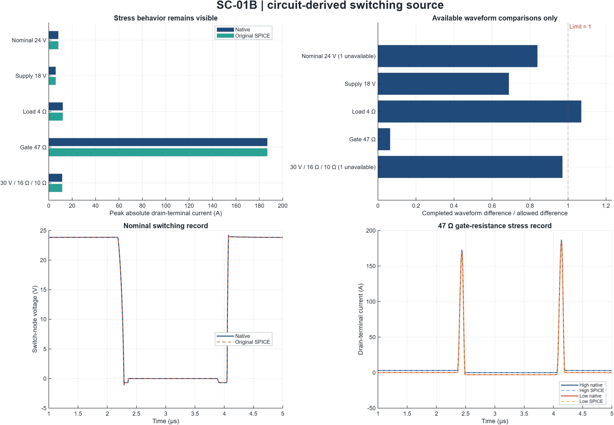
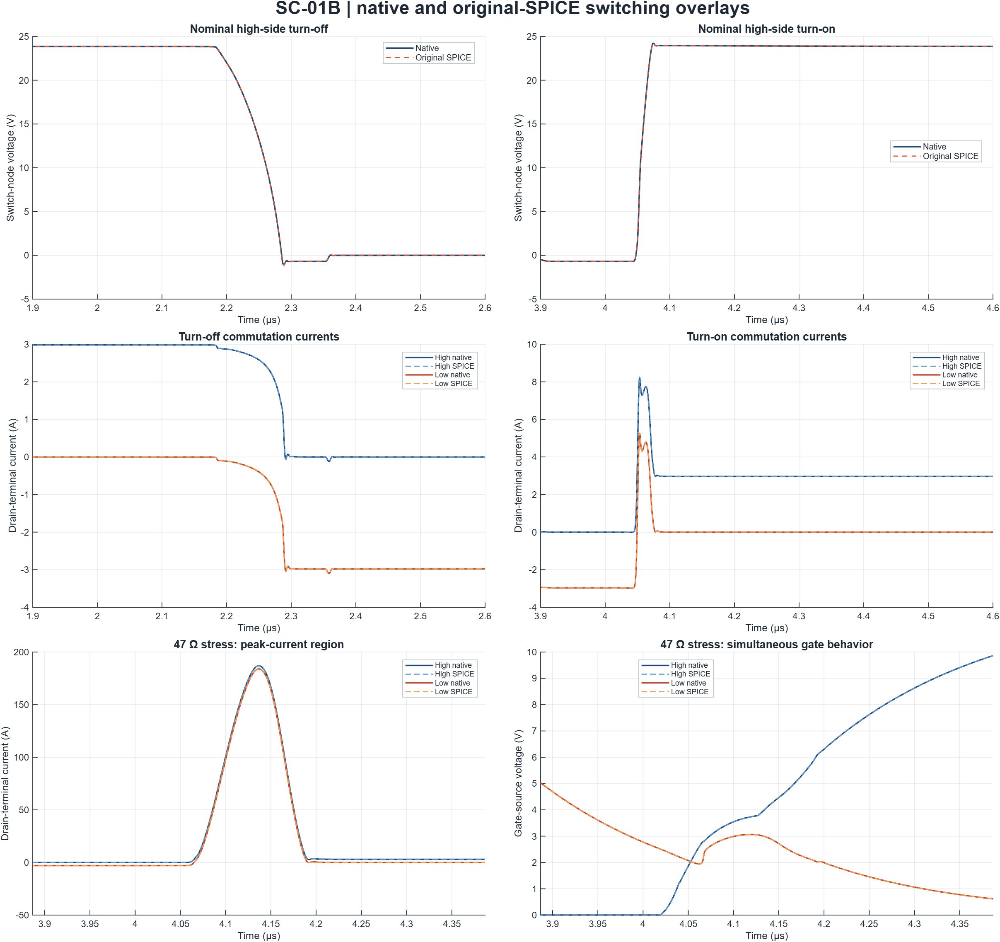

# SC-01B switching-source verification

**The campaign is complete, with failed checks retained. The switching source is not accepted across the full test matrix.**

4 of 5 cases pass all completed waveform comparisons; 0 of 5 pass the full numerical checks, and 0 of 5 pass the declared operating-point checks. The latter also require resolved switching events and device terminal voltages within the imposed limits.

2 comparison check(s) are unavailable because the stricter solver attempt did not produce an accepted complete reference. These checks fail the full numerical campaign. They are not counted as measured waveform disagreement and are excluded from waveform-only summaries and ratio plots. Partial traces from rejected attempts are not accepted as reference data.

Native unresolved-event counts are Nominal 24 V: 1; Supply 18 V: 1; Load 4 Ω: 1; Gate 47 Ω: 2; 30 V / 16 Ω / 10 Ω: 1. Gate-transition classification is checked separately from switch-voltage crossings, so matching first-crossing times alone cannot clear these event failures. The case-by-case flags below identify the recorded cause without changing the frozen gates.

The 47 Ω gate-resistance case reaches 186.919 A peak terminal current in the native model and 186.920 A in original SPICE; its native event record contains 2 unresolved events and 0 repeated voltage crossings. Agreement between two engines does not make that behavior acceptable. This case remains in the frozen matrix as a failed or limited operating point.

The nominal model also has 40.645 ns of simultaneous forward channel conduction above the declared current floor, with 3.197 A peak common forward channel current. Waveform agreement and voltage-limit checks do not establish zero channel overlap; its event-classification outcome is reported separately. This is separate evidence from the 47 Ω stress behavior.

Native internal channel currents show simultaneous forward conduction above the declared floor in 5 of 5 cases. These modeled-current results remain part of the driver/dead-time investigation.

These are two realizations of the same manufacturer equations, with an assumed gate drive and circuit fixture. They do not independently validate real MOSFETs, the complete driver IC, or a robot installation.

## Recorded outcome

| Check | Recorded result |
|---|---|
| Native/original-SPICE numerical campaign | FAIL |
| All operating points | FAIL |
| Automated tests | 84 / 84 passed; 0 failed; 0 incomplete |
| Recorded simulation attempts | 29 |
| Completed / rejected attempts | 27 / 2 |
| Completed records reused | 4 |
| Available / unavailable comparison checks | 22 / 2 |
| Recorded warnings | 0 |
| Physical source validated | No |

| Case | Completed waveform comparisons | Unavailable checks | Full numerical checks | Operating-point checks |
|---|---|---:|---|---|
| Nominal 24 V | PASS (5 checks) | 1 | FAIL | FAIL |
| Supply 18 V | PASS (4 checks) | 0 | FAIL | FAIL |
| Load 4 Ω | FAIL (4 checks) | 0 | FAIL | FAIL |
| Gate 47 Ω | PASS (4 checks) | 0 | FAIL | FAIL |
| 30 V / 16 Ω / 10 Ω | PASS (5 checks) | 1 | FAIL | FAIL |

A full numerical pass requires completed execution, initial-state consistency, waveform and event agreement, required resolved events, signed-energy agreement and external energy closure. Rejected execution is an unavailable check; a completed trace with an unresolved event is a different failure. Neither is silently removed from the full numerical result. Operating-point checks are a separate check of events and terminal-voltage limits; they do not certify hardware safety.

### Event-resolution evidence

The conservative event gate requires ordered, finite and unrepeated threshold crossings, the required endpoint states, and complete event windows. A low-side gate disturbance during high-side turn-on can cross the low gate threshold again. That makes the counterpart gate transition ambiguous under this definition even when the switch-voltage transition resolves and the engines' first-crossing times agree. The classification is retained as recorded; this response is not removed by retiming traces, widening windows or relaxing the event gate.

| Case | Native unresolved events | SPICE unresolved events |
|---|---:|---:|
| Nominal 24 V | 1 | 1 |
| Supply 18 V | 1 | 1 |
| Load 4 Ω | 1 | 1 |
| Gate 47 Ω | 2 | 2 |
| 30 V / 16 Ω / 10 Ω | 1 | 1 |

| Native case / event | Recorded Status | Unmet resolution flags | Voltage recrossings |
|---|---|---|---:|
| Nominal 24 V / pulse_1_high_off | resolved | None | 0 |
| Nominal 24 V / pulse_1_high_on | missing_or_ambiguous_crossing | CounterpartGateResolved=false | 0 |
| Supply 18 V / pulse_1_high_off | resolved | None | 0 |
| Supply 18 V / pulse_1_high_on | missing_or_ambiguous_crossing | CounterpartGateResolved=false | 0 |
| Load 4 Ω / pulse_1_high_off | resolved | None | 0 |
| Load 4 Ω / pulse_1_high_on | missing_or_ambiguous_crossing | CounterpartGateResolved=false | 0 |
| Gate 47 Ω / pulse_1_high_off | missing_or_ambiguous_crossing | GateResolved=false | 0 |
| Gate 47 Ω / pulse_1_high_on | missing_or_ambiguous_crossing | CounterpartGateResolved=false | 0 |
| 30 V / 16 Ω / 10 Ω / pulse_1_high_off | resolved | None | 0 |
| 30 V / 16 Ω / 10 Ω / pulse_1_high_on | missing_or_ambiguous_crossing | CounterpartGateResolved=false | 0 |

VoltageResolved refers to switch-node voltage; GateResolved refers to the high-side gate, and CounterpartGateResolved to the low-side gate transition associated with that commutation. A false counterpart flag must not be described as an unresolved switch-voltage event. The voltage-recrossing column counts switch-node crossings only; it does not count low-side gate recrossings. Full native/SPICE flags, clipping and grazing diagnostics are retained in events.csv.

### Rejected solver attempts

The stricter tolerance check is recorded as rejected rather than accepted with partial data. Baseline records remain separate. A zero warning count does not mean a rejected attempt succeeded: its error/abort reason and completion flag remain part of the evidence.

| Case / attempt | Status | Recorded diagnostic |
|---|---|---|
| Nominal 24 V / spice_tight_tolerance | Rejected; reference unavailable | ngspice diagnostic prevents accepting this run. Retained solver log linked in the rejected-attempt table. |
| ↳ Nominal 24 V | No partial reference accepted | [Retained solver log: timestep failure at 2.019 µs](<nominal/spice_tight_tolerance/ngspice.log>) |
| 30 V / 16 Ω / 10 Ω / spice_tight_tolerance | Rejected; reference unavailable | ngspice diagnostic prevents accepting this run. Retained solver log linked in the rejected-attempt table. |
| ↳ 30 V / 16 Ω / 10 Ω | No partial reference accepted | [Retained solver log: timestep failure at 2.019 µs](<holdout_bus30_load16_gate10/spice_tight_tolerance/ngspice.log>) |

The CSV diagnostic fields preserve original worker paths as provenance. Report links use the collected case/run log first, so the linked evidence remains usable after installation or copying the report with its case/run folders.

## What was modeled

The nominal fixture uses a 24 V source, 8 Ω / 2.5 mH series load, and a preloaded high-side-on DC state. It records a 5 µs off/on commutation pair. The isothermal IAUC100N04S6L014 model uses 25 °C junction/case inputs. The UCC27211A-informed drive uses 12 V, an assumed 3 Ω fixed output resistance, an external 22 Ω gate resistor, a 20 ns internal ramp, and 20 / 19 ns rising/falling delays.

The floating high-side supply is regulated; bootstrap dynamics, full driver output behavior, self-heating, motor back-EMF and physical layout characterization are outside the fixture. Internal vendor charge, diode and package behavior remain in the device model. No manufacturer-model tuning was performed for these comparisons.

| Case | Supply (V) | Load (Ω) | External gate (Ω) | Native initial current (A) | Native peak terminal current (A) | SPICE peak terminal current (A) |
|---|---:|---:|---:|---:|---:|---:|
| Nominal 24 V | 24 | 8 | 22 | 2.98096418 | 8.24605 | 8.24585 |
| Supply 18 V | 18 | 8 | 22 | 2.23572314 | 5.98654 | 5.98685 |
| Load 4 Ω | 24 | 4 | 22 | 5.92433679 | 12.05728 | 12.05619 |
| Gate 47 Ω | 24 | 8 | 47 | 2.98096418 | 186.91947 | 186.91966 |
| 30 V / 16 Ω / 10 Ω | 30 | 16 | 10 | 1.86903237 | 11.54317 | 11.54354 |

## Numerical method and frozen criteria

Native physical-network integration uses local trapezoidal steps of 0.5, 0.25, 0.125 ns. Original SPICE uses maximum steps of 0.25, 0.125 ns. Completed comparisons use the unchanged time origin and the union of integration knots, with linear interpolation and no fitted delay or filtering. The nominal and combined-extension cases also have declared tenfold consistency/tolerance checks; their actual completion and acceptance are reported separately.

The default comparison interval is 1–5 µs. Initial and pre-edge currents are recorded separately. Local consistency tolerances control nonlinear consistency; they are not adaptive integration-error tolerances. SPICE uses the declared source-stepping initialization, with all actual diagnostics preserved in its run records.

| Quantity | Allowed absolute difference or residual |
|---|---|
| Voltage waveform | max(0.01 V, 1% × reference maximum absolute voltage) |
| Current waveform | max(0.01 A, 1% × reference maximum absolute current) |
| Matched event timing | 1 ns; required events must be finite, resolved and classification-compatible |
| Signed terminal energy | max(1 nJ, 1% × absolute reference energy) |
| External energy closure | max(0.1 nJ, 0.1% × recorded energy scale) |

These are absolute allowances combined with relative allowances using the maximum. They are not denominator floors. The reference amplitude is the maximum absolute value over the comparison window. Frozen criteria followed exploratory solver selection and the first SPICE screen; the alternate points were unfitted, not blinded physical validation data.

| Case / comparison | Waveform limit ratio | Timing difference (ns) | Energy limit ratio | Events resolved | Overall |
|---|---:|---:|---:|---|---|
| Nominal 24 V / SPICE tolerances ×10 tighter | Unavailable | Unavailable | Unavailable | Unavailable | FAIL: rejected execution |
| ↳ Nominal 24 V | ngspice diagnostic prevents accepting this run. Retained solver log linked in the rejected-attempt table. | — | — | — | — |
| Nominal 24 V / Native 0.5 → 0.125 ns | 0.83956 | 0.00446958 | 0.15174 | No | FAIL |
| Nominal 24 V / Native 0.25 → 0.125 ns | 0.17708 | 0.00122402 | 0.029466 | No | FAIL |
| Nominal 24 V / SPICE 0.25 → 0.125 ns | 0.12884 | 0.000672542 | 0.022376 | No | FAIL |
| Nominal 24 V / Native ↔ original SPICE | 0.034161 | 0.000245996 | 0.0014071 | No | FAIL |
| Nominal 24 V / Native consistency ×10 tighter | 0 | 0 | 0 | No | FAIL |
| Supply 18 V / Native 0.5 → 0.125 ns | 0.68942 | 0.0121015 | 0.045735 | No | FAIL |
| Supply 18 V / Native 0.25 → 0.125 ns | 0.15661 | 0.00505951 | 0.010087 | No | FAIL |
| Supply 18 V / SPICE 0.25 → 0.125 ns | 0.097105 | 0.000467377 | 0.0095449 | No | FAIL |
| Supply 18 V / Native ↔ original SPICE | 0.02788 | 0.00317719 | 0.00021348 | No | FAIL |
| Load 4 Ω / Native 0.5 → 0.125 ns | 1.0703 | 0.0302709 | 0.20592 | No | FAIL |
| Load 4 Ω / Native 0.25 → 0.125 ns | 0.22347 | 0.00840215 | 0.044877 | No | FAIL |
| Load 4 Ω / SPICE 0.25 → 0.125 ns | 0.13518 | 0.000243522 | 0.023568 | No | FAIL |
| Load 4 Ω / Native ↔ original SPICE | 0.048983 | 0.000867517 | 0.0018305 | No | FAIL |
| Gate 47 Ω / Native 0.5 → 0.125 ns | 0.064587 | Unresolved | 0.009402 | No | FAIL |
| Gate 47 Ω / Native 0.25 → 0.125 ns | 0.018754 | Unresolved | 0.0015574 | No | FAIL |
| Gate 47 Ω / SPICE 0.25 → 0.125 ns | 0.0055303 | Unresolved | 0.00062497 | No | FAIL |
| Gate 47 Ω / Native ↔ original SPICE | 0.0047626 | Unresolved | 1.6622e-05 | No | FAIL |
| 30 V / 16 Ω / 10 Ω / SPICE tolerances ×10 tighter | Unavailable | Unavailable | Unavailable | Unavailable | FAIL: rejected execution |
| ↳ 30 V / 16 Ω / 10 Ω | ngspice diagnostic prevents accepting this run. Retained solver log linked in the rejected-attempt table. | — | — | — | — |
| 30 V / 16 Ω / 10 Ω / Native 0.5 → 0.125 ns | 0.97116 | 0.0476627 | 0.34446 | No | FAIL |
| 30 V / 16 Ω / 10 Ω / Native 0.25 → 0.125 ns | 0.21983 | 0.00921377 | 0.066548 | No | FAIL |
| 30 V / 16 Ω / 10 Ω / SPICE 0.25 → 0.125 ns | 0.13238 | 0.00153016 | 0.0012388 | No | FAIL |
| 30 V / 16 Ω / 10 Ω / Native ↔ original SPICE | 0.037951 | 0.000539323 | 0.0044805 | No | FAIL |
| 30 V / 16 Ω / 10 Ω / Native consistency ×10 tighter | 0 | 0 | 0 | No | FAIL |

A limit ratio of 1 is the acceptance boundary; smaller is better. “Unavailable” means rejected execution produced no accepted comparison reference. “Unresolved” timing means a completed trace lacks finite required timing evidence. Neither means zero error. Per-signal differences, completion flags, diagnostics, classification flags and exact criteria are retained in the CSV and JSON records.

## Switching behavior and energy

The edge overlays use stored integration samples. Switch timing follows crossings of the actual local bus fractions. The stress panels show the 47 Ω peak region and both gate voltages; drain-terminal current includes charge transfer and body-diode behavior, so it is distinct from load current or channel current.

| Case | Native high-side terminal energy (nJ) | Native low-side terminal energy (nJ) | Native modeled channel overlap (ns) |
|---|---:|---:|---:|
| Nominal 24 V | 3675.35 | 1517.02 | 40.645 |
| Supply 18 V | 1995.14 | 605.727 | 33.0368 |
| Load 4 Ω | 6891.47 | 2274.96 | 37.2402 |
| Gate 47 Ω | 255256 | 270490 | 304.193 |
| 30 V / 16 Ω / 10 Ω | 2207.48 | 1683.25 | 16.305 |

Terminal energy is the signed integral of VDS×ID + VGS×IG, including stored-charge transfer; it is not reported as semiconductor heat. The overlap diagnostic uses native internal channel branches: both drain-to-source channel currents must exceed max(1 mA, 0.1% of the window peak absolute load current). Duration is integrated over their piecewise-linear positive intervals. This identifies simultaneous conduction in the model, rather than inferring it only from gate thresholds or terminal-current spikes.

| Case / engine | Closure residual (nJ) | Allowed residual (nJ) | Result |
|---|---:|---:|---|
| Nominal 24 V / native | 5.80728e-07 | 579.932 | PASS |
| Nominal 24 V / spice | 5.99062e-06 | 579.932 | PASS |
| Supply 18 V / native | 2.21685e-08 | 326.412 | PASS |
| Supply 18 V / spice | -5.88789e-07 | 326.412 | PASS |
| Load 4 Ω / native | 2.12338e-06 | 1147.65 | PASS |
| Load 4 Ω / spice | -0.000318426 | 1147.65 | PASS |
| Gate 47 Ω / native | 5.57312e-06 | 1715.44 | PASS |
| Gate 47 Ω / spice | 1.75275e-05 | 1715.44 | PASS |
| 30 V / 16 Ω / 10 Ω / native | 3.42731e-07 | 452.313 | PASS |
| 30 V / 16 Ω / 10 Ω / spice | 0.00101986 | 452.313 | PASS |

External closure includes supply and gate-source work, external resistor losses, signed device terminal energy, and changes in external inductor/capacitor storage. Its energy scale and component terms are retained in balance.csv. Matching energy and waveforms cannot override unresolved switching events or a problematic modeled operating point.

## Limits and next step

Resolve the rejected strict-SPICE checks or establish a separately justified independent comparison before closing full numerical acceptance. The 0.25 ns native refinement passes the waveform gates in all cases; the coarser 0.5 ns load-4-ohm low-current comparison remains failed.

Keep the current five-case evidence unchanged. Investigate the driver/dead-time combination responsible for the stress behavior, then evaluate explicitly revised gate drive, dead time and clamp assumptions as a new campaign. Check modeled channel overlap, voltage peaks and convergence after each justified design change. Follow that with physical parameter identification and measured commutation waveforms before treating the source as representative of the robot hardware. The complete victim/receiver integration remains separate work.

No physical validation, driver-IC equivalence, production variation coverage, thermal qualification or hardware certification follows from these results. Differentiated aggressors require their own sensitivity checks; a small waveform difference alone does not bound peak dv/dt or di/dt.

## Reproduction and evidence

- [Source identity record](source_identity.json): original run-time keys and the separately captured full vendor dependency manifest; the legacy keys omitted the core/helper package and are not backstamped.
- [Independent gate-recrossing audit](supplemental/gate_recrossing_diagnosis.md) and [strict-tolerance diagnosis](supplemental/tight_spice/Diagnosis.md).
- [Device sources and assumptions](<../../Device_Source_and_Assumptions.md>) and [manufacturer source manifest](<../../references/Source_Manifest.json>).
- [SC-01B reproduction instructions](<../../README.md>).
- [Status](status.json), [criteria](criteria.json), [runs](runs.csv), [comparisons](comparisons.csv), [per-signal differences](waveforms.csv), [metrics](metrics.csv), [events](events.csv), and [energy balance](balance.csv).
- [Standalone-model and parameter-override audit](supplemental/standalone_verification.json).
- [Independent Python audit of exported CSVs](supplemental/independent_csv_audit.json): identities, source/gate work, external energy closure, waveform differences and internal channel overlap, with input-file hashes.
- study.mat contains the finest native/SPICE records and complete summary tables; test_results.mat retains individual automated-test results. Per-case folders retain parameters, all integration/tolerance runs, original-SPICE decks/logs, and finest exported traces.

MATLAB: `26.1.0.3276743 (R2026a) Update 3`. Campaign started: 09-Sep-2026 14:39:43. Completed: 09-Sep-2026 14:53:31.
