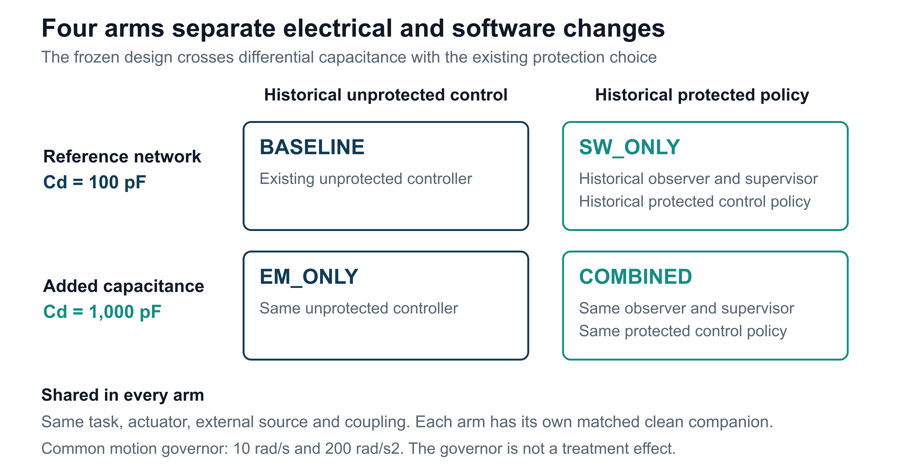
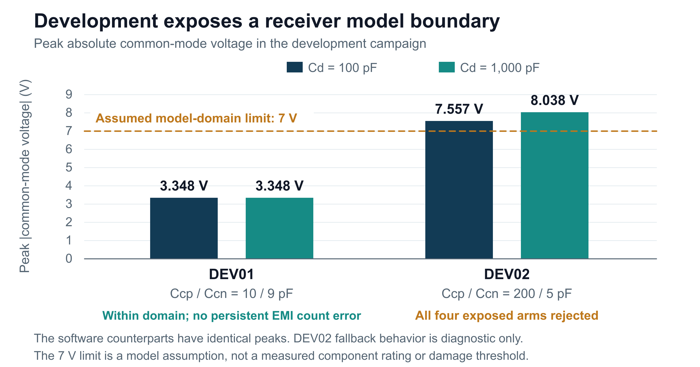

# EMI Resilient Control System for Robotics

EMI Resilient Control
System for Robotics

Research progress and project explanation

Aaron Anderson  |  11 September 2026

This project investigates electromagnetic interference (EMI) in robotic feedback. It now connects electrical interference to encoder counts and closed-loop motor behavior in a verified simulation. The stronger development exposure exceeds the assumed receiver operating domain, so the planned mitigation evaluation remains closed.

Figure 1. The current simulation follows interference through the measurement chain into control. The switching waveform is replayed from a separate saved circuit simulation; the offline audit cannot influence the controller.

Checkpoint in numbers: 468 passing project tests, 116 exact historical controller records, 24 numerical native comparison passes, and 16 development records in eight matched pairs.

This report explains the research question, completed modeling and control work, the latest experiment, its limitations, and the path to a defensible comparison. All reported results are simulations. A combined mitigation benefit and hardware performance remain unestablished.

[Project and code](https://github.com/Aaron-Anderson144/EMI-Resilient-Control-System-for-Robotics)

[Checkpoint evidence](https://github.com/Aaron-Anderson144/EMI-Resilient-Control-System-for-Robotics/blob/main/00_Project_Management/Causal_Receiver_Checkpoint.md)

## 1 The problem and the research question

A motor controller acts on its estimate of where a joint is and how it is moving. Electrical interference can make a feedback signal disagree with the actual motion. If that corrupted signal looks plausible, a controller may command the motor in response to an error that exists only in the measurement.

This project asks how much electromagnetic design and fault-tolerant control can improve a robotic actuator together. Circuit measures can change what reaches a receiver. Control measures can detect inconsistent feedback, limit the response, or enter a stopped state. Their interaction must be tested on the same task and exposure to support a fair comparison.

### A tractable first system

The initial platform is one nominal 24 V rotary actuator with a DC-equivalent motor, an incremental encoder, and a position controller sampled every millisecond. These representative defaults make the work repeatable; they have not been identified from a selected motor, cable, receiver, or installation.

| Model element | Current representation |
|---|---|
| Actuator | Three-state electrical and mechanical motor model |
| Position feedback | 4096 decoded quadrature counts per revolution |
| Controller timing | 1 ms sample interval |
| Current causal coupling path | Capacitive disturbance into encoder channel A |
| Channel B | Ideal clean waveform in this experiment |
| Aggressor | One-way replay of a separate switching-cell simulation |

### Three levels of evidence

System-level fault injection explores how the controller responds to bias, noise, frozen measurements, delayed packets, and supply faults. Circuit models resolve finite electrical edges and receiver thresholds. The new integration connects those electrical events to persistent encoder counts and the motor trajectory.

Hardware measurements will be a further level of evidence. Numerical agreement between implementations supports the equations and event handling, but it does not establish that the assumed parameters reproduce a physical actuator or its electromagnetic environment.

Earlier circuit work verified the SC01A loaded network across 16 cases and 51 native simulations. The switching-cell source was then revised after a high-current stress result. In the corresponding 47 ohm gate case, R2 reduced the modeled terminal peak from 186.919 A to 6.119 A using revised assumed driver behavior. These are numerical model results, with physical source measurements still required.

[Research charter](https://github.com/Aaron-Anderson144/EMI-Resilient-Control-System-for-Robotics/blob/main/00_Project_Management/Research_Charter.md)

[Model and evidence status](https://github.com/Aaron-Anderson144/EMI-Resilient-Control-System-for-Robotics/blob/main/02_Requirements/Research_Evidence_Status.md)

[Revised switching source](https://github.com/Aaron-Anderson144/EMI-Resilient-Control-System-for-Robotics/blob/main/06_Circuit_Simulations/SC01B_R2/README.md)

## 2 How interference reaches the controller

The causal simulation follows the measurement chain continuously between controller samples. A held motor-voltage command determines the motor trajectory. The encoder model finds every quantization-boundary crossing on that trajectory, including reversals that occur within a single sample interval.

### Electrical edges become decoded motion

Intended A transitions drive a loaded differential circuit through finite 100 ns ramps. A saved switching waveform injects interference through the declared coupling capacitors. The circuit retains its continuous state across every source knot and encoder transition. Channel B stays ideal and clean under the frozen experiment scope.

A Schmitt receiver changes the logical A state when the differential voltage crosses its positive or negative threshold. A persistent quadrature decoder then converts valid A/B transitions into signed counts. Invalid two-bit transitions hold the count and resynchronize the previous state. Events at a packet time are processed before that packet is sampled.

| Stage | What the model preserves |
|---|---|
| Motor and encoder | All intended crossings, direction changes, and continuous extrema |
| Loaded network | Circuit state across encoder edges and source replay knots |
| Receiver and decoder | Threshold events, state history, and persistent count error |
| Controller packet | measurement_rad, sourceIndex, and sampleReceived only |
| Independent audit | Plant truth and exposure information kept outside control |

### A saved source with a declared boundary

The aggressor is the nominal SC01B_R2 commutation-cell result. Its original 40,001 samples span 5 microseconds. The experiment adds a declared 100 ns linear return to the initial value, then a DC hold to complete a 50 microsecond period. Two bursts repeat this source 100 times at 20 kHz, anchored at 0.25 s and 1.7 s.

That replay is an external, one-way disturbance. It is not the motor plant's own switching drive and does not model bidirectional electrical coupling. The synthetic return is part of the experiment definition, not an additional measured switching event.

An offline clean shadow receives each exposed run's own intended A/B trajectory without the aggressor. It helps separate EMI count corruption from ordinary receiver delay, without supplying corrected counts or hidden information to the controller.

[Causal implementation](https://github.com/Aaron-Anderson144/EMI-Resilient-Control-System-for-Robotics/blob/main/04_EMI_Models/Four_Way_Causal_Implementation.md)

[Frozen experiment](https://github.com/Aaron-Anderson144/EMI-Resilient-Control-System-for-Robotics/blob/main/04_EMI_Models/Four_Way_EMI_Experiment.md)

## 3 Control development and earlier findings

The control work began with a clean actuator baseline and repeatable fault injection. The resilient policy adds checks on physical plausibility and observer residuals, then selects normal, suspected, degraded, recovery, or latched-stop behavior. The purpose is to manage unreliable measurements while recording the cost of intervention.

### Detection has a defined scope

A model-based observer predicts the actuator response and compares it with measured behavior. Disagreement can trigger protective action, but a small bias, slow drift, or frozen measurement while the actuator is stationary may remain difficult to distinguish from normal operation. The project does not claim universal fault detection.

Recovery and reset behavior have been tested in simulated scenarios. Optional independent-reference recovery remains off by default, and physical independence of a future reference sensor has not been validated. In the current external-packet experiment, encoder reacquisition is disabled.

| Earlier study | Finding and qualification |
|---|---|
| Reduced-order sensitivity | 26 controls; 1886 study simulations; 512 combined parameter sets in two contexts. Assumed voltage-to-angle mapping limits physical interpretation. |
| Controller tuning | A historical candidate improved aggregate normalized tracking by 29.37%, but passed all per-case comparative gates in only 4 of 12 evaluation cases. It was not promoted. |
| Motion governor | Alarm samples fell from 41 to 0 in the preserved clean reversal. In its noisy case, original-request-window tracking RMSE rose from 47.592 to 50.766 degrees, about 6.67%. |
| Separate stop and hold harness | An assumed 0.03 Nm brake reduced loaded stop travel from 92.797 to 1.692 degrees in the studied case. Integration into loaded recovery and hardware remains open. |

### Keep campaign results in their own context

These studies ask different questions and use different fixtures. Their percentages and run counts cannot be pooled into a single resilience score. In particular, historical controller-tuning evaluation is separate from the unopened evaluation stage of the new causal experiment.

The current checkpoint preserves the original controller behavior when the optional external packet boundary is unused. That identity check allows the new measurement chain to be assessed without silently changing the baseline policy.

[Control design records](https://github.com/Aaron-Anderson144/EMI-Resilient-Control-System-for-Robotics/tree/main/05_Control_Algorithms)

[Evidence catalogue](https://github.com/Aaron-Anderson144/EMI-Resilient-Control-System-for-Robotics/blob/main/09_Report/Publication_2026-09-11/Evidence_Catalogue.md)

[Research history](https://github.com/Aaron-Anderson144/EMI-Resilient-Control-System-for-Robotics/blob/main/01_Research/Research_Log.md)

## 4 A controlled comparison of four designs

The central experiment crosses two circuit settings with two controller policies. This design separates the effect of the electrical change, the software policy, and their combination. Each exposed task has a matched clean companion under the same arm.

Figure 2. The four arms share the task and source definition. The circuit factor changes differential capacitance from 100 to 1000 pF; the software factor selects the historical protected policy.

Arm names identify planned comparisons. Neither treatment is established as an improvement.

### Common task and isolated exposure

All arms use the same shaped command, limited to 10 rad/s and 200 rad/s squared. The three-second development task requests positive 30 degrees at 0.1 s and then negative 15 degrees at 1.6 s. Planned evaluation also mirrors the task sign. Load torque is zero. Unrelated faults and the optional independent reference are disabled.

| Stage | Planned records | Completed at this checkpoint |
|---|---|---|
| Development | 16 | 16 |
| Evaluation | 96 | 0 |
| Closure diagnostics | 16 | 0 |

Development uses two coupling fixtures and checks the clean task, decoded timing, count behavior, and receiver domain before evaluation may begin. The frozen PLAN-V1 contract was preserved after the failures. A revised receiver or topology requires a new versioned plan and fresh development and evaluation separation.

[Frozen plan and acceptance criteria](https://github.com/Aaron-Anderson144/EMI-Resilient-Control-System-for-Robotics/blob/main/04_EMI_Models/Four_Way_EMI_Experiment.md)

[Development record index](https://github.com/Aaron-Anderson144/EMI-Resilient-Control-System-for-Robotics/blob/main/00_Project_Management/Verification/Causal_Receiver_2026-09-11/record_index.csv)

## 5 What has been verified

Verification covers several independent questions. Unit and regression tests exercise the implementation. Historical comparisons check that the original controller stayed unchanged. Native circuit comparisons check numerical behavior. Exported-record reconstruction checks whether the saved records support the reported scores.

| Check | Observed result | Interpretation |
|---|---|---|
| Full project suite | 468 / 468 passed | Zero failed or incomplete tests; 67 tests added |
| Legacy controller identity | 116 / 116 exact | All 31 channels, plant states, and recorded reasons |
| Native circuit comparison | 24 / 24 numerical passes | 8 fixtures at 3 maximum time steps |
| Successive refinements | 16 / 16 passed | Consistent results as maximum step is reduced |
| Largest node-voltage error | 0.0802 mV | Below the frozen 0.1 mV allowance |
| Largest threshold timing difference | 0.0020 ns | Below 1 ns; sequences and virtual counts exact |
| Exported-record audit | 352 / 352 checks | 16 records reconstructed and 8 pairs scored |
| Preserved inputs and models | 16 input and 8 model hashes | Frozen evidence inputs and historical models unchanged |

### The reruns are part of the record

The initial native set contained six pointwise node-voltage failures. Those six records were rerun with tighter solver tolerances while retaining the frozen exposure and maximum time steps. Thirty native executions produced the final 24-comparison set. Original traces and failed comparisons were preserved.

### Numerical agreement does not certify usability

Twelve of the 24 final native records exceed the receiver model's assumed absolute common-mode limit of 7 V. They pass the numerical comparison and fail domain usability. Agreement with a circuit reference does not make post-domain receiver output physically interpretable.

The acceptance entrypoint checks complete evidence and the exact implementation inventory. The saved acceptance manifest records failure and cannot open evaluation. The publication changes documentation and packaging; it does not retune the tested source or convert a rejected result into a passing experiment.

[Regression and identity evidence](https://github.com/Aaron-Anderson144/EMI-Resilient-Control-System-for-Robotics/tree/main/00_Project_Management/Verification/Causal_Receiver_2026-09-11)

[Final acceptance gate checks](https://github.com/Aaron-Anderson144/EMI-Resilient-Control-System-for-Robotics/blob/main/00_Project_Management/Verification/Causal_Receiver_2026-09-11/final_gate_verification.json)

## 6 The development result

The two development fixtures produced a useful separation. The lower coupling stayed inside the receiver domain and produced no persistent EMI count error or paired actuator disturbance. The stronger coupling exceeded the domain in every exposed arm, preventing a defensible control-effect comparison.

Figure 3. Peak absolute common-mode voltage in development. Values are shared by the two software policies at each capacitance. The dashed line is the assumed model-domain boundary, not a measured hardware damage threshold.

| Fixture | Coupling Ccp / Ccn | 100 pF | 1000 pF | Outcome |
|---|---|---|---|---|
| DEV01 | 10 / 9 pF | 3.348 V | 3.348 V | 4 arms pass |
| DEV02 | 200 / 5 pF | 7.557 V | 8.038 V | 4 arms rejected |

All eight clean companions pass tracking, command, packet-timing, count-conservation, and receiver-delay guards. This matters because a circuit change that improves an exposed result at the expense of the clean task would not support the intended comparison.

DEV02 first leaves the receiver domain at approximately 0.250002044 s. Its first flagged controller packet is at 0.251 s. The contract then holds A only to complete diagnostic recording. The controller is not told that a domain breach occurred.

Later count errors, tracking differences, and stops in DEV02 are outputs of this declared diagnostic fallback. They cannot establish physical receiver behavior or a benefit from the protected controller. Evaluation remains unrun.

[Domain and clean decoder results](https://github.com/Aaron-Anderson144/EMI-Resilient-Control-System-for-Robotics/blob/main/00_Project_Management/Verification/Causal_Receiver_2026-09-11/domain_and_clean_decoder_summary.csv)

[Development metrics](https://github.com/Aaron-Anderson144/EMI-Resilient-Control-System-for-Robotics/blob/main/00_Project_Management/Verification/Causal_Receiver_2026-09-11/metrics.csv)

## 7 What the findings change

The completed integration makes it possible to trace a circuit event through a decoded measurement into control. That is the publication milestone. The current fixtures do not yet answer how much combined mitigation improves interference tolerance: DEV01 has no persistent corruption to mitigate, while DEV02 leaves the declared receiver domain.

### A larger capacitor is not a universal improvement

In DEV02, increasing differential capacitance from 100 to 1000 pF coincides with a higher peak common-mode voltage, from 7.557 to 8.038 V. This is an observation in the modeled network. It supports reviewing the complete loaded topology and receiver assumptions rather than treating the capacitor value alone as proof of improved immunity.

### The next research decision

The next step is to select and justify a receiver and topology with a defensible operating domain. That requires distinguishing guaranteed receiver operation from any absolute maximum rating, and representing the behavior relevant to the proposed experiment. The present 7 V assumption must remain attached to PLAN-V1 and its rejected outcome.

| Next milestone | Evidence needed to proceed |
|---|---|
| Receiver and topology review | Documented operating limits, threshold behavior, loading, and a clear parameter basis |
| New versioned experiment | Preserved PLAN-V1; declared revised inputs and separate development and evaluation fixtures |
| Development acceptance | Clean-task guards plus in-domain corrupted measurements that can support a comparison |
| Mitigation evaluation | All four arms scored on predefined paired metrics, with uncertainty and failure cases retained |
| Physical validation | Identified hardware parameters and measured waveforms compared with the model |

### Separate open work

Loaded brake handoff and recovery remain separate from the passive stop-and-hold harness. Current-sensor disturbances, brownout and reset behavior, full communication-protocol modeling, and a critically verified literature synthesis also remain incomplete. The current causal experiment covers a deliberately narrower path than the overall research charter.

A later public update should follow the new plan's accepted development stage or a completed physical correlation milestone. That would add a new result to the present verified integration record without rewriting its assumptions.

[Current roadmap](https://github.com/Aaron-Anderson144/EMI-Resilient-Control-System-for-Robotics/blob/main/00_Project_Management/Roadmap.md)

[Open audit actions](https://github.com/Aaron-Anderson144/EMI-Resilient-Control-System-for-Robotics/blob/main/00_Project_Management/Audit_Action_Status.csv)

## 8 How to inspect and reproduce the work

The public package is organized for two readers. A newcomer can read the project overview, this report, and the diagrams. A technical reviewer can follow each result to a compact CSV or JSON record, inspect the frozen experiment and source, and reconstruct the documented checks with the required inputs and software.

| Start here | What it provides |
|---|---|
| README and Public Update | Purpose, current outcome, scope, and navigation |
| Causal Receiver Checkpoint | Detailed September 11 result and evidence links |
| Evidence Catalogue | Claim-to-source mapping and historical campaign references |
| Publication Reproduction guide | Test entrypoints, input restoration, and limits of the public bundle |
| Public Reproduction Inputs archive | Six project-generated pinned data files with original paths and hashes |
| Compact verification directory | Regression, native, development, independent-audit, and acceptance records |

### Software and input requirements

The tested environment uses MATLAB R2026a with Simulink, Control System Toolbox, Simscape, and Simscape Electrical for the relevant models. The exact receiver engine additionally requires a supported C++ compiler. Independent exported-record auditing uses Python and NumPy. Native reference work depends on the recorded circuit runtimes and model provenance.

The public data archive supplies the six pinned project-generated inputs for regression, historical motion comparison, and source replay. It does not contain every full historical campaign, the complete latest raw traces, or all local circuit runtimes. The unchanged Local_Dependencies manifest pins 40 dependencies. The reproduction guide distinguishes reading evidence, running the baseline, and reconstructing the full checkpoint.

### Provenance and repeatable outputs

The numerical checkpoint is local commit a288d344deddd19b5f2fb5abb2b247a04168c972, tagged causal-receiver-checkpoint-2026-09-11 in the original local history. A public source manifest identifies those tracked bytes and the publication overlay. Public Git history is preserved separately; the local checkpoint identifier is not presented as a pre-existing public commit.

Generate new results in fresh output folders. Preserve source hashes, actual compiled-binary identity, runtime details, input manifests, failed cases, and the stage outcome. Recompilation on another environment changes binary identity and requires its own verification; the saved rejected manifest is evidence of this checkpoint, not a portable approval token.

[Publication reproduction](https://github.com/Aaron-Anderson144/EMI-Resilient-Control-System-for-Robotics/blob/main/09_Report/Publication_2026-09-11/Publication_Reproduction.md)

[Pinned dependencies](https://github.com/Aaron-Anderson144/EMI-Resilient-Control-System-for-Robotics/blob/main/00_Project_Management/Local_Dependencies.json)

[Public source manifest](https://github.com/Aaron-Anderson144/EMI-Resilient-Control-System-for-Robotics/blob/main/09_Report/Publication_2026-09-11/Publication_Source_Manifest.json)

## Appendix A Model assumptions and event rules

| Parameter or rule | Declared value or behavior |
|---|---|
| Motor resistance and inductance | 1.2 ohm and 2.5 mH |
| Motor torque and back EMF constants | 0.08 in consistent SI units |
| Inertia and viscous friction | 0.00015 kg m squared and 0.0001 N m s/rad |
| Supply and controller sample time | 24 V and 1 ms |
| Encoder resolution and positive sequence | 4096 decoded counts/revolution; 00 to 10 to 11 to 01 to 00 |
| A driver and edge duration | Complementary 2.5 +/-1 V sources give +/-2 V unloaded differential; 100 ns ramp |
| Schmitt differential thresholds | +0.2 V and -0.2 V |
| Receiver domain | Absolute common-mode voltage at most 7 V |
| Pulse qualification | No minimum pulse filter |
| B channel and independent reference | B ideal clean; optional independent reference off |
| Exposure repetition | 20 kHz; 100 source periods per burst |
| Task and load | 3 s; zero load; common motion governor |
| Native maximum steps | 0.5 ns, 0.25 ns, 0.125 ns |
| Tighter native rerun tolerances | Relative 1e-9; absolute 1e-12 |

### Timing and count semantics

The initial packet has source index 1 at time zero. Decoder events precede coincident packet sampling. Invalid two-bit transitions do not increment the count. Unresolved grazing and a 1 ps event group that straddles an already sampled packet are explicitly rejected; future events cannot retroactively repair a past measurement.

Extra and missing transition counts use a descriptive greedy match on directed state and time within 1 microsecond. This is not an optimal edit-distance measure and is not the central hypothesis criterion. Continuous motor peak current and speed use stationary points; the current-squared integral uses 16-point Gaussian quadrature within each millisecond, independently checked.

These are assumptions and computational contracts. They do not specify a qualified hardware design, a receiver data-sheet guarantee, or a measured actuator installation.

[Frozen assumptions](https://github.com/Aaron-Anderson144/EMI-Resilient-Control-System-for-Robotics/blob/main/04_EMI_Models/Four_Way_EMI_Experiment.md)

[Implementation details](https://github.com/Aaron-Anderson144/EMI-Resilient-Control-System-for-Robotics/blob/main/04_EMI_Models/Four_Way_Causal_Implementation.md)

## Appendix B Evidence and reading guide

Project results are supported by the saved project records listed below. Background references explain electrical and numerical concepts; they do not validate the project's assumed hardware parameters. The linked Evidence Catalogue provides finer claim-level mapping and historical study locations.

[1. Research charter and scope](https://github.com/Aaron-Anderson144/EMI-Resilient-Control-System-for-Robotics/blob/main/00_Project_Management/Research_Charter.md)

[2. Current checkpoint and compact verification evidence](https://github.com/Aaron-Anderson144/EMI-Resilient-Control-System-for-Robotics/blob/main/00_Project_Management/Causal_Receiver_Checkpoint.md)

[3. Frozen four-arm experimental design](https://github.com/Aaron-Anderson144/EMI-Resilient-Control-System-for-Robotics/blob/main/04_EMI_Models/Four_Way_EMI_Experiment.md)

[4. Causal circuit receiver and decoder implementation](https://github.com/Aaron-Anderson144/EMI-Resilient-Control-System-for-Robotics/blob/main/04_EMI_Models/Four_Way_Causal_Implementation.md)

[5. Full project test results](https://github.com/Aaron-Anderson144/EMI-Resilient-Control-System-for-Robotics/blob/main/00_Project_Management/Verification/Causal_Receiver_2026-09-11/all_project_tests.csv)

[6. Native comparison and refinement records](https://github.com/Aaron-Anderson144/EMI-Resilient-Control-System-for-Robotics/blob/main/00_Project_Management/Verification/Causal_Receiver_2026-09-11/native_final_acceptance.csv)

[7. Independent reconstruction and scoring audit](https://github.com/Aaron-Anderson144/EMI-Resilient-Control-System-for-Robotics/blob/main/00_Project_Management/Verification/Causal_Receiver_2026-09-11/independent_audit.json)

[8. Development receiver-domain and clean checks](https://github.com/Aaron-Anderson144/EMI-Resilient-Control-System-for-Robotics/blob/main/00_Project_Management/Verification/Causal_Receiver_2026-09-11/domain_and_clean_decoder_summary.csv)

[9. Rejected evaluation acceptance manifest](https://github.com/Aaron-Anderson144/EMI-Resilient-Control-System-for-Robotics/blob/main/00_Project_Management/Verification/Causal_Receiver_2026-09-11/rejected_acceptance.json)

[10. Historical findings and claim-level evidence catalogue](https://github.com/Aaron-Anderson144/EMI-Resilient-Control-System-for-Robotics/blob/main/09_Report/Publication_2026-09-11/Evidence_Catalogue.md)

[11. Public reproduction instructions](https://github.com/Aaron-Anderson144/EMI-Resilient-Control-System-for-Robotics/blob/main/09_Report/Publication_2026-09-11/Publication_Reproduction.md)

### Terms used in this report

| Term | Meaning in this project |
|---|---|
| Common mode | The average of the two receiver input voltages relative to the modeled reference |
| Differential voltage | The voltage difference between receiver inputs |
| Quadrature | Two logical waveforms whose state sequence indicates motion and direction |
| Schmitt receiver | A logical receiver with separate switching thresholds for rising and falling input |
| Paired clean companion | The same arm and task simulated without the EMI aggressor |
| Numerical verification | Checks that the implementation follows the specified equations and event rules |
| Physical validation | Comparison with measured behavior from an identified real system |

The result to carry forward is specific: the causal simulation and its records are verified, the stronger development fixture violates the assumed receiver domain, and the four-arm benefit remains an open research question.

### Background reading

TI distinguishes differential sensitivity from common-mode operation. Analog Devices explains how return-path impedance creates reference errors. MathWorks discusses solver selection and step-size comparisons. These sources support the concepts used here; they do not establish the project parameters.

[TI differential interface guidance](https://www.ti.com/lit/an/slla070d/slla070d.pdf)

[Analog Devices grounding](https://www.analog.com/en/resources/analog-dialogue/studentzone/studentzone-march-2017.html)

[MathWorks physical simulation solvers](https://www.mathworks.com/help/simscape/ug/making-optimal-solver-choices-for-physical-simulation.html)
