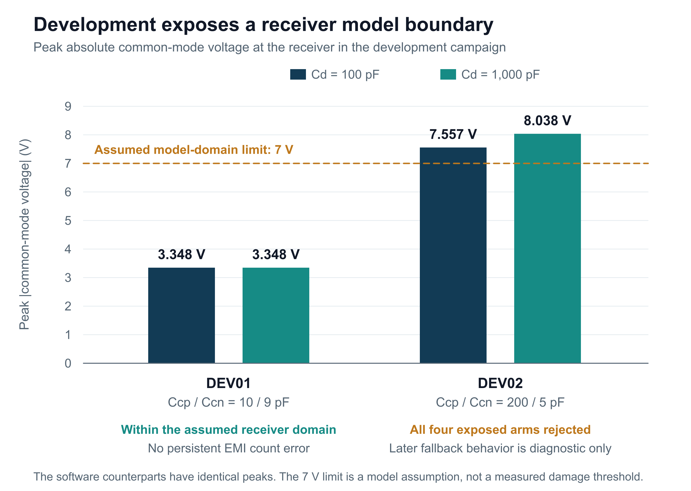

# Connecting electrical interference to robot control

The EMI Resilient Control System for Robotics project investigates a practical question: can electrical design and fault-tolerant control work together to keep an actuator behaving predictably when interference corrupts its feedback?

The project now has a connected simulation of that chain. Motor motion generates encoder transitions. An electrical network models how a separate switching source couples into encoder channel A, while channel B stays ideal and clean. A receiver and persistent decoder turn those signals into the position measurement used by the controller. This makes it possible to follow a disturbance from voltage to decoded count to actuator response.

Earlier work established the actuator baseline, repeatable sensor and communication faults, loaded circuit models, and an observer with supervised degraded operation and recovery. Those studies also retained difficult results: some faults escaped detection, an attractive controller tuning was rejected by its case-by-case criteria, and a zero-voltage stop allowed motion under load. These findings are retained in the research record.

The latest milestone is numerically verified: all 468 project tests pass, 116 historical controller records remain exactly unchanged, and all 24 required native circuit comparisons pass numerically. The final comparison set includes six tighter-tolerance reruns; numerical agreement does not establish receiver usability. An independent reconstruction also passes 352 checks across 16 development records and their eight matched comparisons.

The development result sets a clear boundary. Under the lower coupling fixture, all four configurations pass and no persistent EMI count error appears. Under the higher fixture, every configuration exceeds the receiver model's assumed 7 V common-mode range. The model continues only to preserve rejected diagnostics; those later trajectories cannot demonstrate real receiver behavior or a mitigation benefit.

That means the planned four-way evaluation has not been opened, and combined electromagnetic/software improvement is not yet established. The next step is to justify the receiver and its operating range, preserve this experiment, and define a new versioned comparison before testing again. Hardware identification and bench validation remain ahead.

The publication package explains the architecture, the results, the assumptions and the evidence needed next. The repository provides the source and reproducibility record so readers can inspect how the conclusions were reached.

[Read the illustrated report](EMI_Robotics_Progress_Report.pdf) | [Inspect the evidence](Evidence_Catalogue.md) | [Reproduce the work](Publication_Reproduction.md)

[Explore the project](https://github.com/Aaron-Anderson144/EMI-Resilient-Control-System-for-Robotics)
