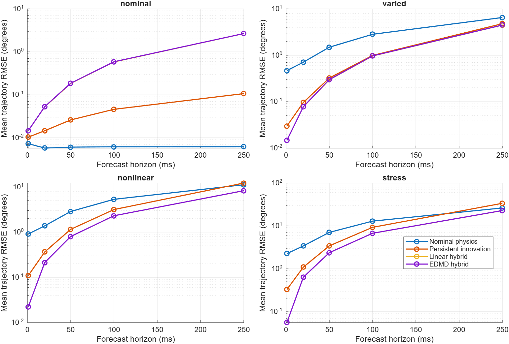
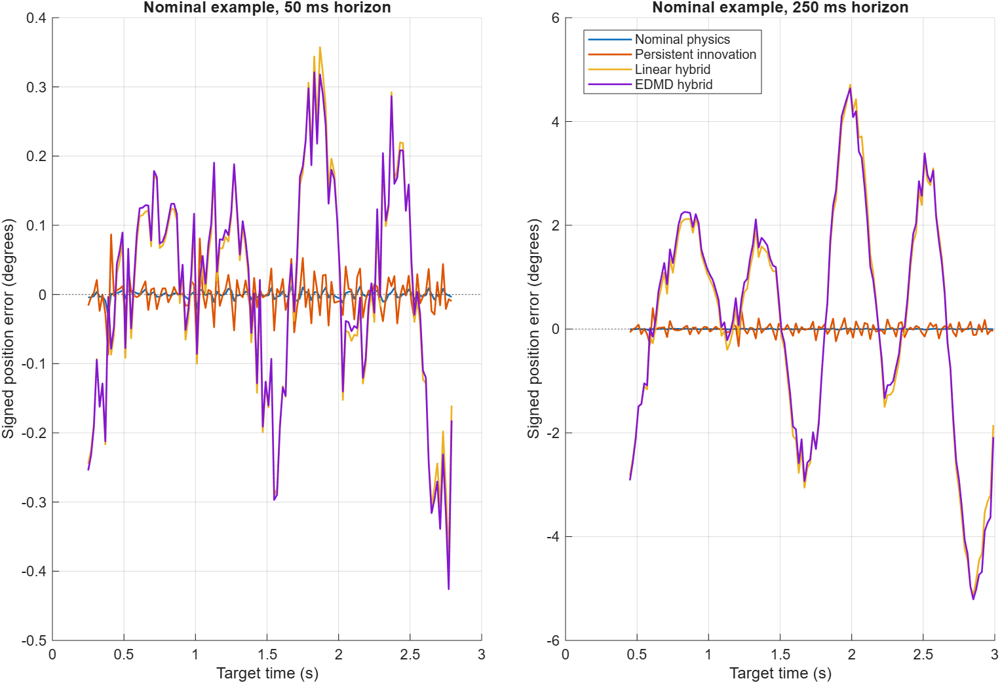
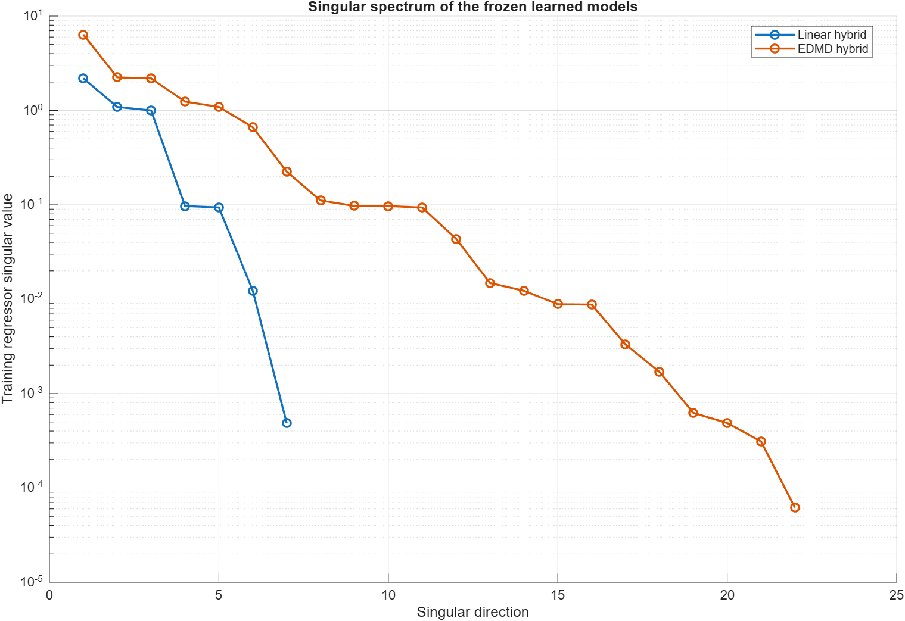

# EDMD forecast diagnostics

Frozen-model exploratory analysis saved 102400 endpoint records. Per-run truth RMSE and failure counts reproduce the original saved benchmark (maximum RMSE difference 5e-16 radians). No model was refitted.

The previously inspected evaluation set is used to diagnose behavior. It is not a fresh test of a revised model.

## Nominal error by horizon

| Model | Horizon (ms) | Mean trajectory RMSE (degrees) | Mean absolute per-trajectory bias (degrees) | Mean centered error RMS (degrees) |
|---|---:|---:|---:|---:|
| Nominal physics | 1 | 0.00729062 | 0.000457572 | 0.007272 |
| Nominal physics | 20 | 0.00575175 | 0.000293706 | 0.00574195 |
| Nominal physics | 50 | 0.00605117 | 0.000294892 | 0.00604167 |
| Nominal physics | 100 | 0.00616704 | 0.000295348 | 0.00615764 |
| Nominal physics | 250 | 0.00618586 | 0.000295422 | 0.00617648 |
| Persistent innovation | 1 | 0.0103614 | 0.000452758 | 0.0103479 |
| Persistent innovation | 20 | 0.0145765 | 0.000298087 | 0.0145719 |
| Persistent innovation | 50 | 0.0260213 | 0.000326954 | 0.0260179 |
| Persistent innovation | 100 | 0.045972 | 0.000380613 | 0.045969 |
| Persistent innovation | 250 | 0.106685 | 0.000671152 | 0.106681 |
| Linear hybrid | 1 | 0.0146151 | 0.000816568 | 0.0145787 |
| Linear hybrid | 20 | 0.0525955 | 0.00492278 | 0.0522154 |
| Linear hybrid | 50 | 0.184243 | 0.0174479 | 0.182759 |
| Linear hybrid | 100 | 0.583251 | 0.0556142 | 0.578281 |
| Linear hybrid | 250 | 2.66254 | 0.307299 | 2.63271 |
| EDMD hybrid | 1 | 0.0146489 | 0.000791394 | 0.0146133 |
| EDMD hybrid | 20 | 0.05302 | 0.00509719 | 0.0526222 |
| EDMD hybrid | 50 | 0.185958 | 0.0186401 | 0.184401 |
| EDMD hybrid | 100 | 0.587962 | 0.0601071 | 0.582831 |
| EDMD hybrid | 250 | 2.66669 | 0.307273 | 2.63838 |

Bias is calculated within each trajectory before averaging its magnitude; opposite-signed biases cannot cancel. Centered RMS describes scatter around each trajectory mean. Overlapping origins are not independent trials.

## Event and model evidence

`event_summary.csv` separates targets within 50 ms of a true-velocity sign reversal from targets away from reversals. Zero-velocity plateaus are handled explicitly. Labels are offline diagnostics only. Missing velocity excludes reversal groups. Origins start at 200 ms; the initial startup interval is outside coverage. No explicit load steps or receiver faults exist in these records.

`model_diagnostics.csv` contains 2 fitted-model rows. `singular_spectrum.csv` records retained directions and ridge filtering. `lifted_rollout_diagnostics.csv` separates held-out one-step fitting error from recursive quadratic consistency. These are diagnostic quantities, not stability certificates or proof of a particular failure mechanism.

## Figures

