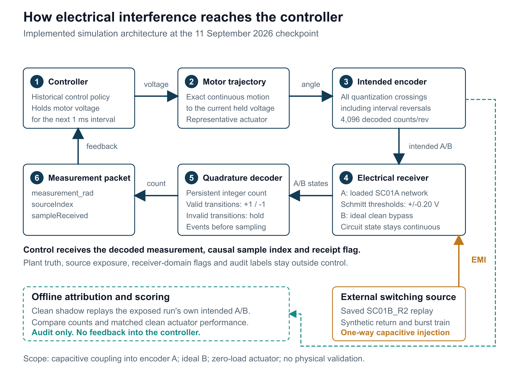

# EMI Resilient Control System for Robotics

**Can electrical design and fault-tolerant control work together to make robotic actuators more resistant to electromagnetic interference?**

This research project builds a MATLAB/Simulink actuator model, electrical interference models, and a controller that detects suspect feedback and manages degraded operation, recovery and stop commands. Its purpose is to follow interference through the whole chain: from a switching waveform, through the receiver circuit and encoder count, to the actuator's motion.

The work is at a **verified simulation and integration milestone**. The latest experiment also establishes a clear limit: its higher exposure leaves the assumed receiver operating domain, so the planned comparison of combined mitigation has not proceeded to evaluation. Hardware validation remains future work.

[Illustrated progress report (PDF)](09_Report/Publication_2026-09-11/EMI_Robotics_Progress_Report.pdf) · [Editable report (Word)](09_Report/Publication_2026-09-11/EMI_Robotics_Progress_Report.docx) · [Public project update](09_Report/Publication_2026-09-11/Public_Update.md) · [Reproduction guide](09_Report/Publication_2026-09-11/Publication_Reproduction.md)

## How the project works



The controller holds a voltage command for each 1 ms interval. The motor trajectory determines the intended encoder transitions; the loaded circuit and receiver determine the observed transitions; a persistent quadrature decoder supplies the measured position for the next control decision. The controller receives position, a source index and a receipt flag. It does not receive the true position or an interference label.

The interference source is an externally replayed, numerically verified switching waveform. It is a one-way susceptibility study, with an explicitly defined synthetic return between replay pulses. The present causal experiment models a loaded A-channel circuit with ideal B-channel timing. It does not yet model bidirectional coupling to the actuator's own driven winding or a complete physical encoder installation. See the [implementation and scope](04_EMI_Models/Four_Way_Causal_Implementation.md).

## September 2026 checkpoint

| Verified evidence | Result and meaning |
|---|---|
| Full project regression suite | **468/468 tests pass**, with zero failures or incomplete tests |
| Original controller behavior | **116/116 records remain exact**, including all 31 channels, plant states and reasons |
| Native circuit numerical comparisons | **24/24 comparisons and 16/16 refinements pass**; largest node-voltage error is 0.0802 mV against a 0.1 mV allowance |
| Development experiment | **16 records / 8 matched clean-exposed pairs**; all eight clean companions pass |
| Independent record audit | **352/352 reconstruction and scoring checks pass** |
| Evaluation | **Unopened**: receiver-domain acceptance is rejected; combined benefit is not demonstrated |

These counts describe different checks and are not additive. The final native set includes six tighter-tolerance reruns after initial failures: 30 executions produced 24 final comparisons. Numerical agreement does not establish physical validity or receiver usability.

The development result is the key finding:


- **Lower exposure (DEV01, coupling 10/9 pF):** all four arms pass, with no persistent EMI count error or paired actuator disturbance. Peak common mode is about 3.348 V.
- **Higher exposure (DEV02, coupling 200/5 pF):** all four exposed arms exceed the assumed 7 V common-mode domain. Peaks are 7.557 V with 100 pF differential capacitance and 8.038 V with 1,000 pF. These records are rejected for interpreting control effects.

The 7 V value is an assumed model-domain boundary, not a measured damage or immunity limit. After it is crossed, the model holds A only to finish diagnostic recording. Later count errors, tracking differences and stop commands cannot be credited as physical receiver behavior or mitigation benefit.

Read the [checkpoint](00_Project_Management/Causal_Receiver_Checkpoint.md), [compact verification evidence](00_Project_Management/Verification/Causal_Receiver_2026-09-11), and [requirement evidence status](02_Requirements/Research_Evidence_Status.md) for the supporting records and limits.

## The comparison being developed

The frozen first plan separates electrical and software treatments using four arms, each paired with its own clean run:

| Arm | Differential capacitance | Control policy |
|---|---:|---|
| BASELINE | 100 pF | Original baseline policy |
| EM_ONLY | 1,000 pF | Original baseline policy |
| SW_ONLY | 100 pF | Phase 3 protected policy |
| COMBINED | 1,000 pF | Phase 3 protected policy |

A larger capacitance is the prescribed electrical treatment, not an established improvement. Tracking, current, command effort, count corruption, false alarms and recovery must be assessed together. The current plan completed 16 development records; its 96 evaluation records and 16 separate closure diagnostics remain unopened. See [FOUR-WAY-EMI-PLAN-V1](04_EMI_Models/Four_Way_EMI_Experiment.md).

The next research milestone is a justified receiver/topology decision, followed by a new reviewed experiment version. PLAN-V1 and its negative development outcome remain preserved. Hardware identification, calibrated limits and physical validation follow as separate work.

## Work completed along the way

| Workstream | Contribution | Scope still open |
|---|---|---|
| Actuator and fault library | Reproducible representative actuator; encoder, communication and motor-bus fault models | Selected hardware and identified parameters |
| Reduced-order EMI models | Capacitive, inductive and shared-impedance studies; parameter sensitivity | Measured coupling and receiver transfer |
| Native electrical circuits | Finite-edge loaded network and revised switching-source verification | Physical circuit measurements and component selection |
| Fault-tolerant control | Observer, suspect/degraded/recovery/stop modes; explicit missed-fault and recovery cases | Wider model/load uncertainty and measured thresholds |
| Motion shaping | Rate-alarm samples in the preserved clean reversal reduced from 41 to zero, with a 6.67% original-request tracking RMSE cost | Calibrated operating envelope |
| Separate stop/hold study | Assumed mechanical-brake model and independent numerical audit | Integrated loaded brake handoff and physical stop/restart |
| Causal integration | Continuous circuit state, receiver events, persistent decoder and strict measurement boundary | Accepted four-arm evaluation and physical validation |

Historical campaign sizes and their original acceptance limits remain in the [research log](01_Research/Research_Log.md) and [report evidence map](09_Report/Report_Outline.md). A simulation stop command does not by itself establish safe physical holding.

## Run the project locally

For a first analytical baseline, install MATLAB and Control System Toolbox, open `03_MATLAB`, and run:

```matlab
startup_project
study = run_baseline;  % creates a fresh timestamped results folder
```

The complete checkpoint was tested with MATLAB R2026a Update 3, Simulink, Control System Toolbox, Simscape and Simscape Electrical. The causal receiver engine also requires a configured MATLAB-supported C++ compiler. Historical independent circuit comparisons use pinned local ngspice runtimes. The R2 vendor model is supplied by the tested MATLAB installation.

**A source-only clone is not the complete experiment archive.** Regression fixtures, the frozen switching waveform, historical records and runtime distributions have separate storage and identity checks. Start with the [publication reproduction guide](09_Report/Publication_2026-09-11/Publication_Reproduction.md), which distinguishes reading evidence, running the baseline and reproducing the full suite or research campaigns. The [unchanged dependency manifest](00_Project_Management/Local_Dependencies.json) and [local bootstrap instructions](00_Project_Management/Local_Reproduction.md) identify the required retained files.

## Repository map

| Folder | Contents |
|---|---|
| `00_Project_Management` | Charter, roadmap, checkpoints, compact evidence and provenance |
| `01_Research` | Research log and literature-review plan |
| `02_Requirements` | Requirements, FMEA, test plan and evidence status |
| `03_MATLAB` | Actuator, fault and control implementation; tests and saved models |
| `04_EMI_Models` | Model assumptions, experiment contract and causal implementation |
| `05_Control_Algorithms` | Detection, supervision, recovery, motion and stop/hold designs |
| `06_Circuit_Simulations` | Native circuits, independent references and receiver engine |
| `07_Data` / `08_Results` | Data organization and results planning |
| `09_Report` | Progress publication and report assembly map |
| `10_Hardware_Design` | Future testbed planning |

The numerical parameters are representative assumptions, not measurements from a selected actuator, cable or receiver. This project does not claim demonstrated hardware immunity, universal fault detection, physical safety or compliance. Formal Draft requirement approvals remain unchanged.
